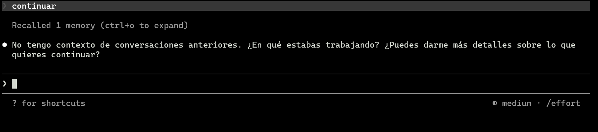

<p align="center">
  
  
  
  
  
  
</p>

# PULSO — The Emotional Map of Mexico

> **An AI-powered simulation engine that visualizes how Mexico's 32 states react emotionally to any event — rendered as 1,200+ glowing nodes in real-time.**

Type any event — *"the dollar rises to 25 pesos"*, *"earthquake in Mexico City"*, *"Mexico wins the World Cup"* — and watch the emotional shockwave propagate across the country.


---

## What is PULSO?

PULSO is a real-time emotional visualization engine for Mexico. It combines:

- **1,200+ animated nodes** grouped by state, each pulsing with emotion-coded colors
- **Keyword-based simulation** (28 event categories, instant, zero API cost) with **LLM fallback** (Gemini AI for unrecognized events)
- **Live news feed** from Mexican RSS sources with auto-sentiment classification
- **Regional diversity modeling** — not every state reacts the same way to the same event

The project explores how collective emotional responses to events can be simulated and visualized at a national scale, using a combination of rule-based systems and generative AI.

---

## Live Demo

> **[Coming soon — deploy in progress]**

---

## How It Works

### The Three-Layer Emotion Engine

```
Layer 1: BASE STATE
  → LLM generates Mexico's "resting" emotional state once per day
  → Each state gets a specific emotion, intensity, and description
  → Based on current economic, political, and social context

Layer 2: NEWS INFLUENCE  
  → RSS feeds from 10+ Mexican news sources
  → Headlines classified by keyword matching (zero LLM cost)
  → Gradual emotional shifts with exponential decay
  → Consistency check every 6 hours prevents drift

Layer 3: USER SIMULATION
  → User types any event (max 50 words)
  → Keyword match (28 categories) → instant response, $0 cost
  → No match? → Gemini AI generates full 32-state reaction
  → Results cached for 48 hours to minimize API calls
```

### Regional Diversity Algorithm

PULSO doesn't paint the whole country one color. For any event, the engine considers:

- **Geographic proximity** to the event epicenter
- **Economic profile** (border/industrial/tourism/agriculture/oil states)
- **Population weight** (larger states react more strongly)
- **Cultural factors** (conservative vs progressive regions)

A minimum of 3 different emotions are always present on the map. No single emotion can dominate more than 20 of 32 states.

### The Emotion Contagion Matrix

Satellite nodes around each state follow a probabilistic distribution:

| If state emotion is | 70% satellites | 15% | 8% | 3.5% | 3.5% |
|---|---|---|---|---|---|
| Anger | Anger | Fear | Sadness | Joy | Hope |
| Joy | Joy | Hope | Sadness | Anger | Fear |
| Fear | Fear | Sadness | Anger | Hope | Joy |
| Hope | Hope | Joy | Anger | Fear | Sadness |
| Sadness | Sadness | Fear | Anger | Hope | Joy |

---

## Tech Stack

| Layer | Technology | Why |
|---|---|---|
| Backend | **Python 3.11 + FastAPI** | Async, fast, single binary |
| Frontend | **Vanilla JS + Canvas 2D** | No frameworks, 60fps on mobile |
| AI | **Google Gemini 2.5 Flash** (via litellm) | Free tier, fast, good enough |
| Database | **SQLite** (single file) | Zero config, no separate server |
| Validation | **Pydantic v2** | Strict schemas for all LLM output |
| Hosting | **Single server** | FastAPI serves API + static files |

**Deliberate constraints:**
- No React, Vue, or any JS framework — pure Canvas 2D
- No WebGL — must work on any phone browser
- No separate database server — SQLite file on disk
- No Redis, no queues — everything in-process
- Total production cost: ~$5-20/month

---

## Architecture

```
┌─────────────────────────────────────────────────┐
│                   FRONTEND                       │
│  Canvas 2D: 1,200+ nodes · glow · particles     │
│  Emotion filters · Drag interaction · Wave FX    │
│  News sidebar · Share button · Mobile responsive │
└──────────────────────┬──────────────────────────┘
                       │ GET /api/state
                       │ POST /api/simulate  
                       │ GET /api/news
┌──────────────────────┴──────────────────────────┐
│                   BACKEND (FastAPI)               │
│                                                   │
│  Input Guard ──→ Keyword Simulator (28 rules)    │
│       │                    │                      │
│       │              no match?                    │
│       │                    ↓                      │
│       │          LLM Fallback (Gemini)           │
│       │                    │                      │
│       └──→ Diversity Engine ──→ Cache (SQLite)   │
│                                                   │
│  News Fetcher (RSS) ──→ Sentiment Classifier     │
│  Rate Limiter (10/hr/IP) · CORS · Admin Auth     │
└──────────────────────────────────────────────────┘
```

---

## Features

### Visual Engine
- **Multi-layer glow rendering** — each node has 4 layers: outer halo, mid ring, solid core, bright center
- **Pulse animation** — nodes breathe with sinusoidal oscillation, each at different phase
- **Particle system** — glowing dots flow between state connections showing emotional contagion
- **Shockwave effect** — radial flash propagates from epicenter on simulation
- **Drag interaction** — pull any state node, satellites follow with elastic physics
- **Emotion filtering** — click any emotion to highlight matching nodes, others fade

### Simulation Engine
- **28 keyword categories** — economy, sports, natural disasters, politics, crime, culture, health, migration, technology, and more
- **Regional diversity** — economic profiles, geographic distance, and cultural factors determine per-state reactions
- **LLM fallback** — unrecognized events get full AI analysis via Gemini
- **Smart caching** — similar events return cached results with slight variation
- **Input moderation** — regex + heuristic filter blocks inappropriate content

### Data Pipeline
- **10+ Mexican RSS sources** — El Universal, Reforma, Animal Político, Proceso, Milenio, and more
- **Auto-sentiment classification** — headlines analyzed using the same keyword engine
- **Gradual emotional shifts** — exponential decay prevents sudden map color jumps
- **Consistency checker** — periodic LLM validation prevents emotional drift

---

## Quick Start

### Prerequisites
- Python 3.11+
- A Gemini API key (free): https://aistudio.google.com/apikey

### Run locally

```bash
git clone https://github.com/Omardelllano/pulse.git
cd pulse

# Install dependencies
pip install .

# Copy env and add your Gemini key
cp .env.example .env
# Edit .env: add GEMINI_API_KEY=your-key-here

# Run with mock provider (no API key needed, for development)
python -m pulso serve --provider mock

# Run with Gemini AI (requires API key)
python -m pulso serve --provider gemini-free

# Open http://localhost:8000
```

### Run with Docker

```bash
docker compose up
# Open http://localhost:8000
```

### Run tests

```bash
pip install ".[dev]"
pytest
# 243 tests passing
```

---

## API Reference

| Endpoint | Method | Description |
|---|---|---|
| `/api/state` | GET | Current emotional state of all 32 states |
| `/api/simulate` | POST | Simulate reaction to an event (`{"event_text": "..."}`) |
| `/api/news` | GET | Latest news headlines with sentiment |
| `/api/health` | GET | Server status and stats |
| `/api/state/refresh` | POST | Force base state regeneration (admin auth required) |

### Example

```bash
curl -X POST http://localhost:8000/api/simulate \
  -H "Content-Type: application/json" \
  -d '{"event_text": "el dólar sube a 25 pesos"}'
```

---

## Cost Model

| Stage | LLM Cost | Hosting | Total |
|---|---|---|---|
| Development (mock provider) | $0 | $0 | **$0** |
| MVP (Gemini free tier) | $0 | $5/mo | **$5/mo** |
| Production (1,000 users/day) | ~$15/mo | $5/mo | **$20/mo** |

The keyword simulator handles ~80% of user inputs at zero LLM cost. Only unrecognized events trigger a Gemini API call (~$0.001 per simulation).

---

## Project Structure

```
pulse/
├── pulso/                 # Backend
│   ├── api/               # FastAPI routes, middleware, security
│   ├── engine/            # Keyword simulator, cache, input guard
│   ├── providers/         # LLM providers (mock, gemini, deepseek)
│   ├── models/            # Pydantic schemas, DB models
│   ├── data/              # Mexico states config, contagion matrix, event rules
│   └── news/              # RSS fetcher, sentiment processor
├── frontend/              # Static frontend
│   └── js/
│       ├── engine/        # Node generator, edge generator, wave, particles
│       ├── renderer/      # Canvas renderer, glow effects, drag controller
│       └── ui/            # Filters, tooltip, event input, news feed
├── tests/                 # 243 tests
└── PULSO_MASTER_BRIEFING_v2.md  # Full technical specification
```

---

## Security

- Rate limiting: 10 simulations/hour per IP
- Input sanitization: regex + heuristic filter on all user input
- No user data stored: simulations are ephemeral (48h cache, then deleted)
- No authentication required: no personal data collected
- Admin endpoints protected with Bearer token
- CORS configurable via environment variable
- All secrets via environment variables, never hardcoded

---

## Roadmap

- [ ] Zoom to explore individual state clusters
- [ ] Historical replay — "how did Mexico feel last week?"
- [ ] INEGI demographic data integration for statistical grounding
- [ ] User accounts and saved simulations
- [ ] Public API for researchers
- [ ] Multi-country support (start with LATAM)

---

## Built With

This project was built using a phase-gated development methodology with AI-assisted coding (Claude Code). The full technical specification is documented in [PULSO_MASTER_BRIEFING_v2.md](PULSO_MASTER_BRIEFING_v2.md).

Previous project using the same methodology: [Agile Wargame Simulator](https://github.com/omardelllano/agile-wargame-simulator)

---

## License

MIT

---

<p align="center">
  <strong>PULSO</strong> — Because a country's emotions deserve to be seen.
</p>
